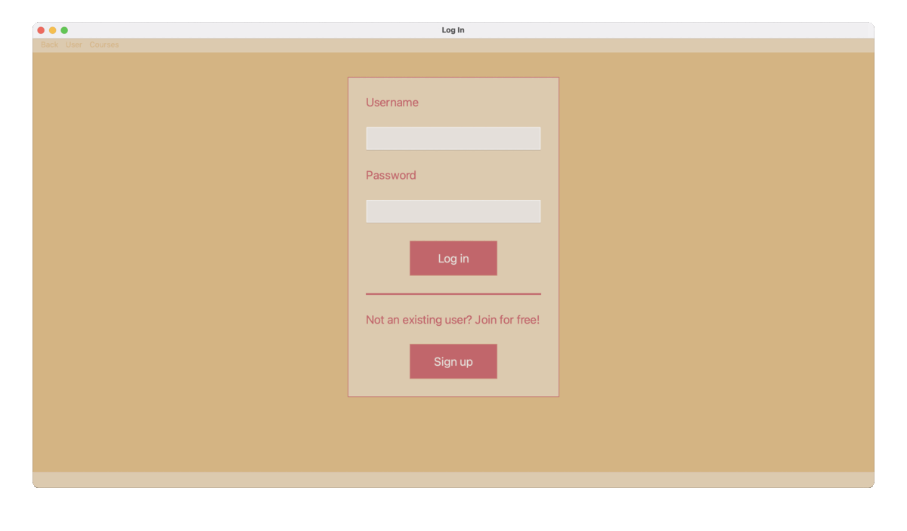

Course Central
==============

Description
-----------
An online course management system is useful to store details of online courses from different websites, in one place. With sort and search functionality, this program makes it easy for users to find the online course they need.

Because of the Graphic User Interface (GUI), navigating through the program is effortless. This project demonstrates Python-MySQL connectivity and implements a GUI using PyQt5.

The underlying database consists of four tables – Users, Instructors, Courses and Transactions in which the users’ details, instructors’ details, courses’ details, and records of purchased courses are stored respectively. 

The key features of this project are the ability to create an account and log-in, to view all courses, to search for courses by name, to sort courses (according to name, difficulty or fees), and to purchase courses. Users can also update their details or delete their account. From an instructor account, there are options to add/update/delete courses. Once a course is purchased, a receipt is generated. Opening a purchased course, opens a web browser which loads the course's link.

Demonstration
-------------

# Getting Started

## Prerequisites
1. Python 3.6.1 or higher
2. MySQL Server 8.0.19 or higher
3. Python Modules:
    1. PyQt5 5.15.2 (for GUI)
    2. PyQtWebEngine 5.14.0 (for web browser)
    3. Regex 2020.11.13 (for regex matching)
    4. werkzeug 1.0.1 (for password encryption)
    5. mysql-connector-python 8.0.20 (for mysql database connection)

The Python modules can be installed using pip.

## Running Locally
After cloning the repository, simply run

    python main.py
    
from the root directory.
